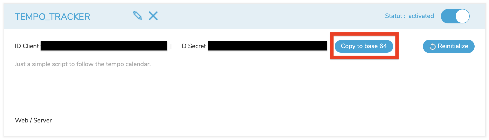

# RTE TEMPO Day Script

Just a simple bash script to retrieve the RTE TEMPO day color (France's electrical network) for the next day. [Option TEMPO](https://particulier.edf.fr/fr/accueil/gestion-contrat/options/tempo.html#/selection-bp) is a contract type with EDF (France's energy provider) that has a variable energy price. The cost of electricity depends on the color: blue, white, or red, in increasing cost.

You need to provide an OAUTH2 key from the [RTE API](https://data.rte-france.com). Click on the `Copy to base 64` button and save it to a `.env` file in the same location as the `rte_tempo_day.sh` script:



In `.env` it should look like this:

```
OAUTH_KEY="yourbase64keyhere"
```

Then run the script and it will return either: `"BLUE"`, `"WHITE"`, or `"RED"`.

## Notes

Sometimes the script fails if you run it in succession to quickly. Or randomly sometimes it fails, not fully sure why. I've added some sleep functions to help spread out the authentication calls just in case it's that.
